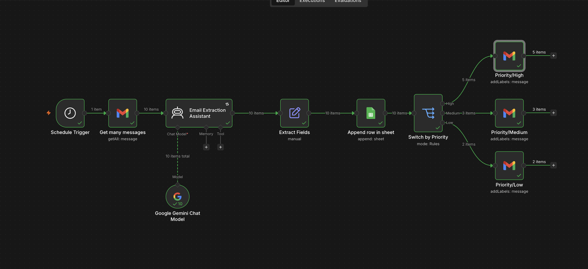
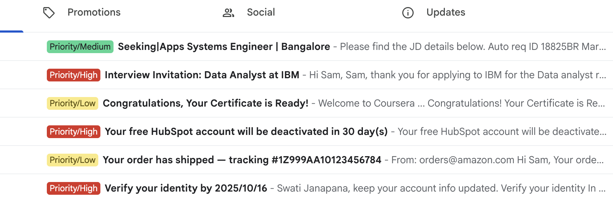
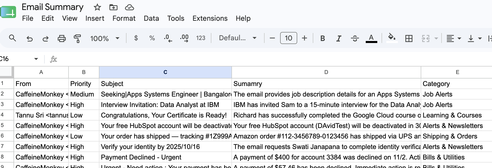

#  📬 Email Triage Assistant using n8n


## 📌 Overview

This project is an AI-powered email triage workflow built with n8n.

The workflow reads Gmail messages, uses Google Gemini to analyze the email content, extracts useful information, logs the result into Google Sheets, and applies a Gmail priority label based on the AI classification.

This project helps organize emails by priority and creates a structured record of email summaries.

## 🖼️ Workflow Screenshot








## 🔄 Workflow

- Schedule Trigger
- Get many Gmail messages
- Email Extraction Assistant
- Extract Fields
- Append row in Google Sheets
- Switch by Priority
    - High → Add Gmail label: Priority/High
    - Medium → Add Gmail label: Priority/Medium
    - Low → Add Gmail label: Priority/Low

## 📁 Project Structure

```
02-email-triage-assistant

├── README.md
├── workflow/
│   └── email-triage-assistant.json
├── screenshots/ 
│   ├── email_summary.png 
│   │── gmail_label.png
│   └── workflow-canvas.png
└── samples/
    ├── priority-labels-rules.md
    └── triage-rules.md

```

##  🏷️ Priority Labels

- Priority/High
- Priority/Medium
- Priority/Low

### Email Categories

- Bills & Utilities
- Alerts & Newsletters
- Shipping & Orders
- Learning & Courses
- Job Alerts


## ⚙️ What This Workflow Does

- Retrieves multiple Gmail messages
- Uses Google Gemini Chat Model for email analysis
- Generated AI summaries
- Extracts the fields
- Logs email details into Google Sheets
- Routes the emails based on the priority 
- Applies the priority label in Gmail

## 📊 Google Sheets Output

   Each processed email is logged into Google Sheets with fields such as:

| Column   | Description          |
|----------|----------------------|
| From     | Sender email         |
| Subject  | Email subject        |
| Priority | AI-detected priority |
| Summary  | Short email summary  |
| Category | AI-detected category |


## 🛠️ Tools Used

* n8n
* Gmail
* Google Sheets
* Google Gemini Chat Model
* Edit Fields node
* Switch node


## 🚀 Future Improvements

* Add duplicate-processing prevention
* Add category-based Gmail labels
* Add automatic draft replies for job-related emails
* Add retry handling for AI model rate limits
* Add better error handling for Gmail label failures

