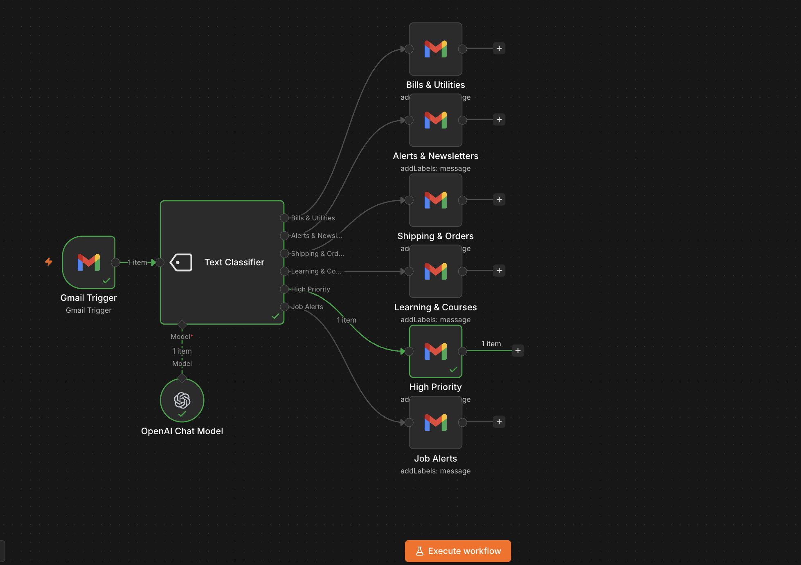
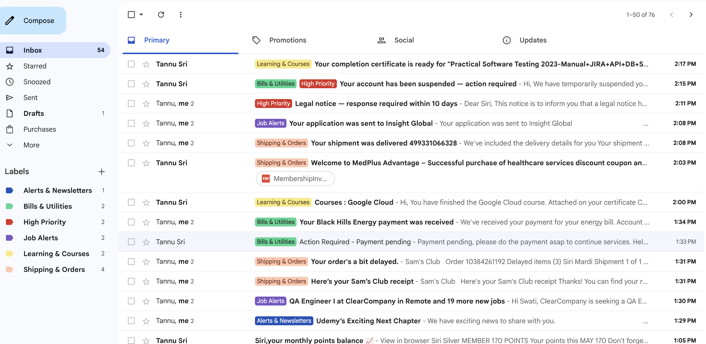

# 📧 Gmail Label Classifier using n8n 


## 📌 Overview

This project is an AI-powered Gmail label classifier workflow built using n8n.

The workflow starts when a Gmail message is received. The email content is sent to a Text Classifier node, which uses an OpenAI Chat Model to classify the email into exactly one predefined label. Based on the classification result, n8n routes the email to the correct Gmail node and applies the matching label.

## 🖼️ Workflow Screenshot




## 🔄 Workflow

Gmail Trigger  
→ Text Classifier  
→ OpenAI Chat Model  
→ Route by selected label  
→ Gmail Add Label action

## 📁 Project Structure

```

01-gmail-label-classifier

├── README.md
├── workflow/
│   └── gmail-label-classifier.json
├── screenshots/
│   ├── gmail_label.png
│   └── workflow-canvas.png
└── samples/
    ├── classifier-rules.md
    └── labels-used.md
```

## 🏷️ Labels Used

- Bills & Utilities
- Alerts & Newsletters
- Shipping & Orders
- Learning & Courses
- High Priority
- Job Alerts

## 🧠 Classification Rules

The Text Classifier uses prompt-based rules to classify emails. Each label has its own description and keyword guidance.

The detailed rules are documented here:

- `samples/classifier-rules.md`
- `samples/labels-used.md`

## ⚙️ What This Workflow Does

- Detects incoming Gmail messages
- Reads the email details
- Sends the content to a Text Classifier
- Uses an OpenAI Chat Model for classification
- Chooses exactly one matching label
- Routes the workflow based on the selected label
- Applies the correct Gmail label automatically

## 🛠️ Tools Used

- n8n
- Gmail Trigger
- Gmail node
- Text Classifier
- OpenAI Chat Model

## 🔧 Setup

Requires n8n instance with Gmail and OpenAI/Gemini credentials configured.

## 🚀 Future Improvements


- Add Google Sheets logging
- Send reply for High Priority emails
- Add draft reply generation for Job Alerts
- Add more detailed keyword rules for each label

