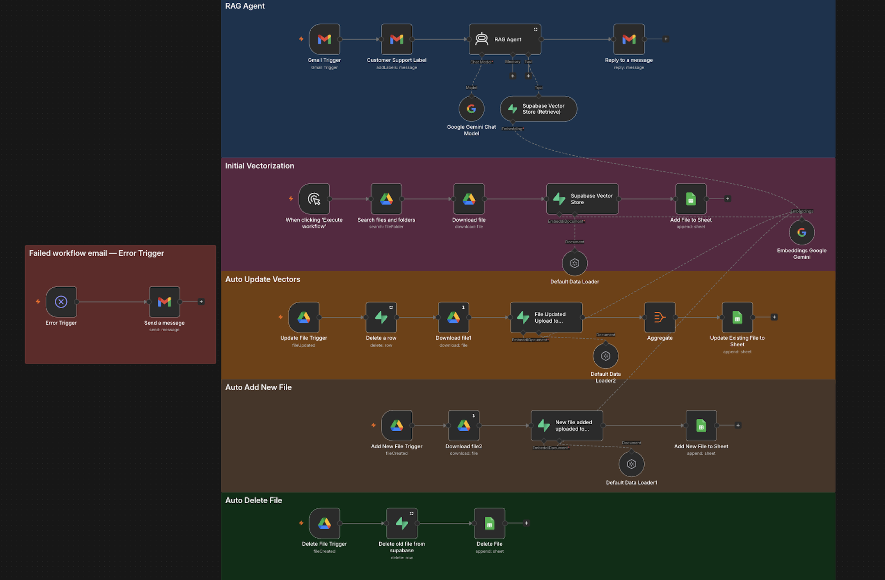

#  📬 RAG Pipeline Support Agent


## 📌 Overview

This project is an AI-powered email triage workflow built with n8n.

The workflow reads Gmail messages, uses Google Gemini to analyze the email content, extracts useful information, logs the result into Google Sheets, and applies a Gmail priority label based on the AI classification.

This project helps organize emails by priority and creates a structured record of email summaries.

## 🖼️ Workflow Screenshot




## 🔄 Workflow

- Auto-replies to customer emails using RAG
- Vectorizes documents from Google Drive into Supabase
- Auto-updates vectors when documents change
- Logs all activity to Google Sheets
- Error notifications via Gmail

## 📁 Project Structure

```
rag-pipeline-support-agent

├── README.md
├── reports/
│   └── rag_pipeline_workflow_summary.xlsx
├── workflow/
│   └── rag_pipeline.json
├── screenshots/ 
│   ├── customer-support-email-reply.png
│   │── failed-workflow-email.png
│   └── workflow-canvas.png
└── samples/
    ├── shopnest_customer_support_policy.docx
    ├── shopnest_product_catalog_categories.docx
    └── shopnest_promotions_deals_policy.docx
    
```

## ⚙️ What This Workflow Does

- RAG Agent -> Gmail trigger + AI reply 
- Initial Vectorization -> Bulk document ingestion
- Auto Update Vectors -> Re-index on file change 
- Auto Add New File -> Index new files automatically 
- Auto Delete File -> Remove deleted file chunks
- Error Notifier -> Alert on workflow failure


##  Setup
1. Create Supabase project and run SQL setup
2. Add Google Drive folder for documents
3. Configure Gmail credentials in n8n
4. Import workflow JSONs into n8n
5. Run Initial Vectorization
6. Publish all workflows


## 📊 Google Sheet Summary

   Each processed email is logged into Google Sheets with fields such as:

| Column    | Description         |
|-----------|---------------------|
| File Name | File name           |
| Event     | Action taken        |
| TimeStamp | Date and time       |
| Status    |  |


## 🛠️ Tech Stack

* n8n (workflow automation)
* Supabase (pgvector vector database)
* Google Gemini (embeddings + chat)
* Google Drive (document storage)
* Gmail (trigger + reply)
* Google Sheets (audit log)


## Sample Data
`RAG_Pipeline_Workflow_Summary.xlsx` contains sample execution 
logs generated during testing. Timestamps reflect manual test 
runs — in production these are generated automatically.