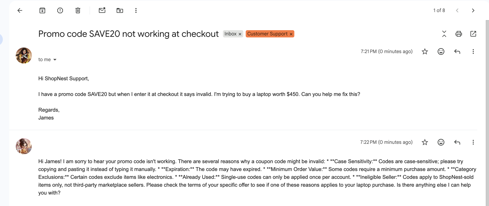
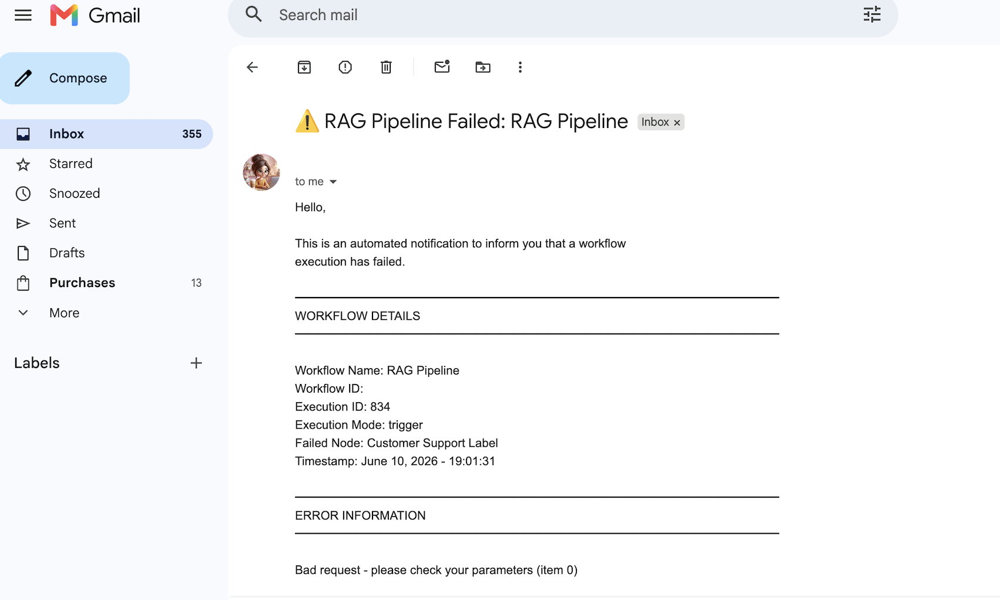

#  🤖 RAG Support Agent Pipeline


## 📌 Overview

This project is a RAG-based customer support agent built with n8n. It uses Supabase as a vector database to store product, policy, and promotion documents from Google Drive. 

When a customer email arrives, the agent retrieves relevant context from the vector store and uses Google Gemini to generate an accurate reply automatically.

The pipeline also keeps the vector store in sync — adding, updating, or removing document chunks whenever files change in Google Drive.

If any part of the pipeline fails, an error notification is sent via Gmail.


## 🖼️ Workflow Screenshot







## 📁 Project Structure

```
rag-support-agent-pipeline

├── README.md
├── reports/
│   └── rag_pipeline_workflow_summary.xlsx
├── workflow/
│   └── rag_pipeline.json
├── screenshots/ 
│   ├── customer-support-email-reply.png
│   │── failed-workflow-email.png
│   └── workflow-canvas.png
└── samples/
    ├── shopnest_customer_support_policy.docx
    ├── shopnest_product_catalog_categories.docx
    └── shopnest_promotions_deals_policy.docx
    
```

## 🔄 What This Workflow Does

- RAG Agent -> Gmail trigger + AI reply 
- Initial Vectorization -> Bulk document ingestion
- Auto Update Vectors -> Re-index on file change 
- Auto Add New File -> Index new files automatically 
- Auto Delete File -> Remove deleted file chunks
- Error Notifier -> Alert on workflow failure


## ⚙️ Setup

1. Create Supabase project and run SQL setup
2. Add Google Drive folder for documents
3. Configure Gmail credentials in n8n
4. Import workflow JSONs into n8n
5. Run Initial Vectorization
6. Publish all workflows


## 📊 Google Sheet Summary

   Each processed email is logged into Google Sheets with fields such as:

| Column    | Description       |
|-----------|-------------------|
| File Name | File name         |
| Event     | Action taken      |
| TimeStamp | Date and time     |
| Status    | Success / Failed  |


## 🛠️ Tech Stack

* n8n (workflow automation)
* Supabase (pgvector vector database)
* Google Gemini (embeddings + chat)
* Google Drive (document storage)
* Gmail (trigger + reply)
* Google Sheets (audit log)


## Sample Data
`RAG_Pipeline_Workflow_Summary.xlsx` contains sample execution 
logs generated during testing. Timestamps reflect manual test 
runs — in production these are generated automatically.


